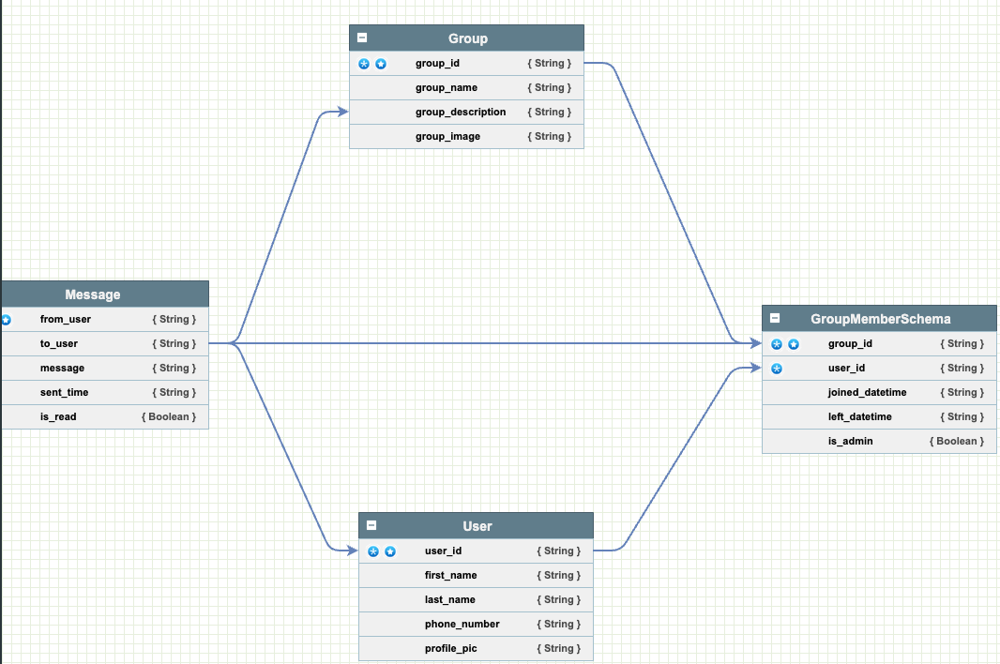
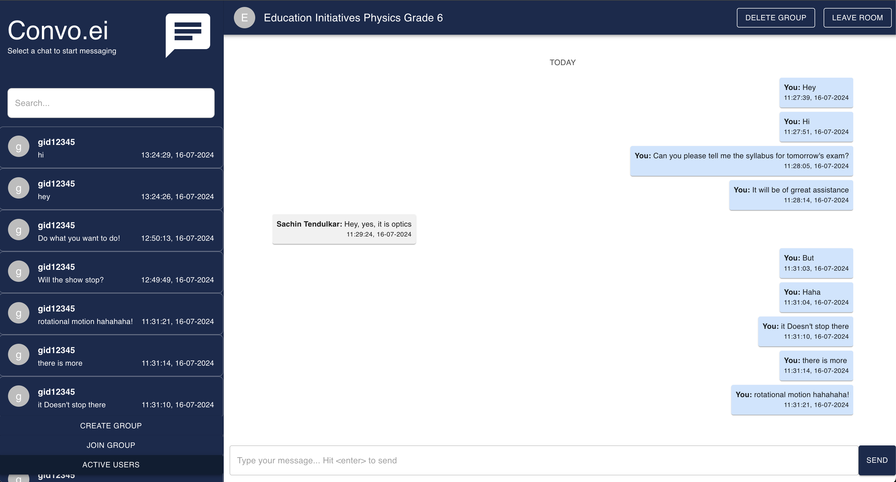

# Convo.ei

## Overview
Convo.ei is a real-time chat application that enables users to join chat rooms, send and receive messages, and fetch recent chat history. Built with a combination of Node.js, Express, MongoDB, and React, Convo.ei offers a seamless and responsive chat experience.

## Requirement Analysis/ Product Research 

[Chat App Research Doc](https://emphasized-capri-785.notion.site/Chat-App-876b19954a3e403f99d4a94228e6279a)


## Features
- Real-time chat
- Join chat rooms by ID
- Create New Chat Room
- Send and receive messages
- Fetch recent chat history
- In a chat, always scroll to bottom 
- Get the recent chats sidebar
- Navigate between chats using the sidebar
- End to End Encryption (not yet)
- Text compression to DB (not yet)
- Text decompression from DB (not yet)
- User Authentication
- Create New User 
- User Validations 
- Room Validations

## Technologies
- Node.js
- Express
- MongoDB
- React
- Socket.io

## Installation
1. Clone the repository
2. Install dependencies
```
cd client
npm install
cd ..
cd server
npm install
```
3. Start the client server
```
cd client
npm run start
```
4. Start the backend server
```
cd server
npm run start
```
5. Open your browser and navigate to `http://localhost:3000`
6. Backend server is running on `http://localhost:8001`
7. Enjoy chatting!

## Database Schema



## Screenshots

- Home Page


- Main Chat Page 

## Testing Credentials

- User ID: uid12345
- Chat Room ID: gid12345

## Active Issues 
- Check Issues 

