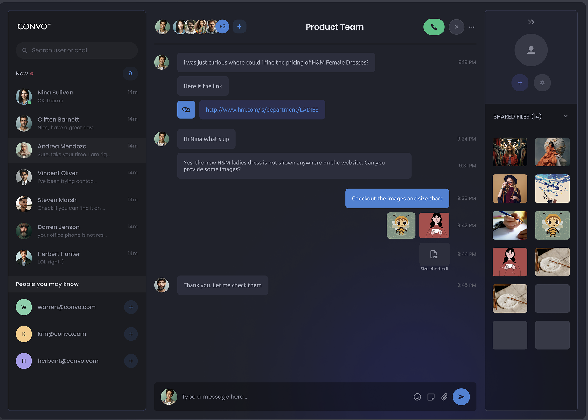

## functional requirements 
- [x] allow users to create/ join chat rooms by unique room id 
- [x] allow users to send and receive messages in chat rooms
- [x] display a list of active users in chat room 

### optional 
- [x] private messaging 
- [x]message history, so that chat persists 

## Key Focus
1. Behavioural Pattern: Use the Observer Pattern to notify clients of new messages or user activities.
2. Creational Pattern: Use Singleton to manage the state of the chat rooms.
3. Structural Pattern: Use the Adapter Pattern to allow the system to work with
different types of client communication protocols (WebSocket, HTTP, etc.).
4. OOP: Apply encapsulation, polymorphism, and inheritance effectively.

## phase 2
- [x] images and video
- [x] emojis
- [x] last seen
- [x] typing indicator
- [x] read receipts
- [x] video call 

## UI idea

